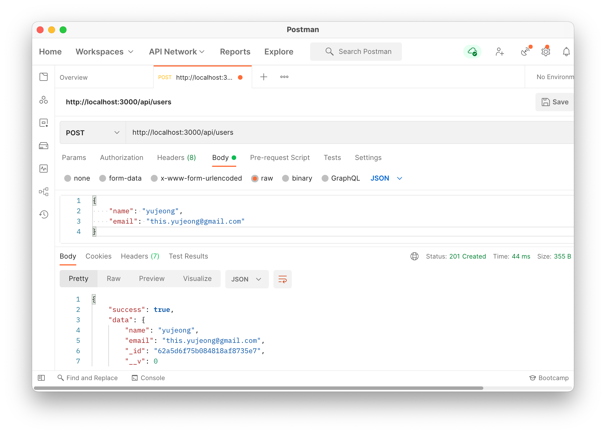

# next-with-mongoose

[Next.js](https://nextjs.org/) with [Mongoose](https://mongoosejs.com/) template.

### `.env.local` setting

```
MONGODB_URI=[YOUR MONGODB URI]
```

### Running Locally

```
yarn install
yarn dev
```

### Postman Example


